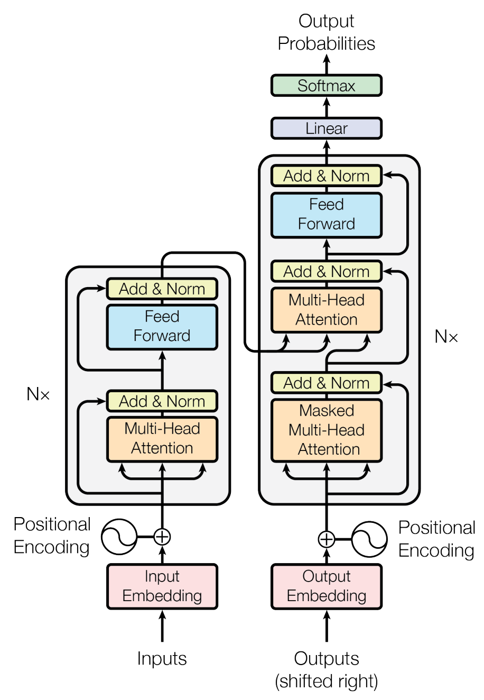

## Download the Paper

[Paper](https://arxiv.org/pdf/1706.03762)

## 1. What is new about this specific paper, compared to prior work?

This paper proposes the **Transformer**, a novel Seq2Seq architecture that relies **entirely on attention mechanisms**, rather than recurrent or convolutional layers, to encode and decode sequences.

This design allows highly **parallelizable** computations and effectively captures **long-range dependencies** in sequence data, such as text for machine translation tasks.

## 2. What is new about this specific paper, compared to prior work?

- Elimination of Recurrent/Convolutional Layers: Unlike earlier Seq2Seq models that used LSTMs, GRUs, or CNNs, the Transformer uses **only attention modules** (self-attention and encoder-decoder attention).  
- The paper introduces **multi-head attention**, enabling the model to learn from multiple "subspace" representations in parallel.  
- Because the architecture does not have a built-in notion of sequence order (as an RNN does through time steps), the authors propose a sinusoidal **positional encoding** to inject sequence position information.  
- By removing the recurrence constraint, the Transformer can process all positions in a sequence **in parallel**, significantly reducing training time.

## 3. What experiments were run to support the arguments in this paper?

1. **Machine Translation**: experiments on two major datasets:
   - *WMT 2014 English-to-German*: The Transformer reached sota BLEU scores (outperforming previous single and even ensemble models) at the time of publication.
   - *WMT 2014 English-to-French*: A new high performance in translation with significantly less training cost compared to prior sota methods.

2. **Parsing**: They also tested the Transformer on an **English constituency parsing** task (the Penn Treebank WSJ dataset). The model produced competitive results, demonstrating that the architecture generalizes beyond translation.

## 4. What are the shortcomings/limitations of this paper?

- While self-attention has a constant path length for dependencies, it scales quadratically with sequence length `O(n^2)` in time and memory. For very long inputs (e.g., thousands of tokens), this can be expensive.  
- The attention mechanism is global by design. While this can be advantageous for capturing long-range dependencies, there is no inherent, built-in emphasis on local, contiguous structures (unlike convolutions), which might be suboptimal for certain tasks.  
- Although they demonstrated strong transfer to parsing, the Transformer's **performance on other specialized tasks** might still need careful modifications or additional modules.

## 5. What is a reasonable next step to build upon this paper?

- Investigate *sparse* or *local* attention mechanisms (e.g., restricting attention to neighborhoods or using learned patterns) to handle longer sequences more efficiently.  
- **Adapt the architecture to non-text data** (e.g., images, audio, video) by combining attention layers with domain-specific preprocessing or embedding methods.  
- Explore ways to reduce the one-token-at-a-time decoding bottleneck, potentially via parallel or **non-autoregressive** decoding approaches.  
- Investigate advanced optimization strategies, better positional encoding schemes, or improved architectures that could further reduce memory and computational requirements while preserving or improving performance.
